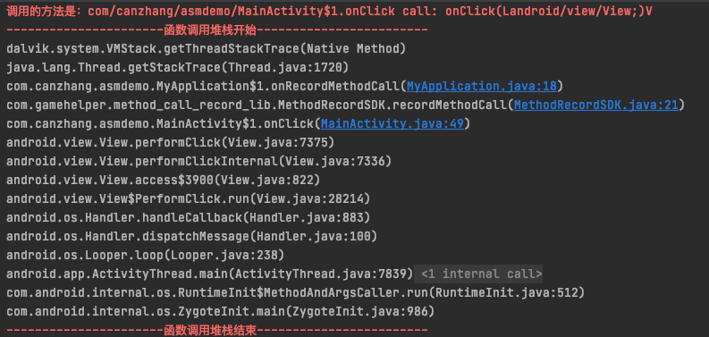

# 项目介绍
本项目主要是一些基于asm实现的字节码操作插件，目前有如下插件：
## 方法调用检测插件
### 功能
提供方法调用检测及替换能力，能快速知道方法调用的位置或者直接替换方法实现，协助定位解决问题，或者提高工作效率。

### 应用场景举例

#### 敏感函数调用筛查
android 隐私权限相关的api或者字段要求越来越严格，我们需要配合监管部门处理相关的函数调用，这就需要我们找到：
* 在哪里调用的？
* 调用的方法是什么？
* 具体的调用堆栈是什么？
* 改完了自后，怎么辅助自校验是否改好了？（很多第三方平台耗时较久，不适合快速测试）

#### 替换方法调用指令
了解到了敏感api是哪里调用的，但是不好改
* 第三方sdk内部引用的，但是一时sdk又不能支持修改
* 较多功能关联，改动较大，时间不够
* ...

#### 快速找到点击的位置
随着项目推进，业务和页面都越来越复杂，在定位问题的时候，我们找一个点击位置往往会遇到如下问题：
* 页面层层嵌套
* 几十种item类型
* 子父类各种方法复写
* ...

针对上面的场景我们就可以使用方法调用监控来快速找到调用的位置或者替换调用的方法。

### 涉及module
* app:主module,用于写一些测试插桩效果的的测试代码
* method_call_record_lib ：插桩代码库（就是插桩所要插入的代码，不集成的话插桩依然会成功，但是运行找不到类会崩溃）
* method_call_record_plugin：插桩插件

### 使用方式

#### 1、添加仓库
```
maven {url 'https://mirrors.tencent.com/repository/maven/tencent_public/'}
```
#### 2、在工程gradle中引入插件库
```
dependencies {
    classpath 'com.gamehelper.android:method_call_plugin:1.0.4-SNAPSHOT'
}
```
#### 3、在主module中引入lib库（参考下方配置：仅`hookMethodEnterMap`、`hookMethodInvokeMap`需要配置此项，方便打印堆栈,其他配置项可忽略此配置）
```
dependencies {
    implementation 'com.gamehelper.android:method_call_record_lib:1.0.0-SNAPSHOT'
}
```
#### 4、在主module中注册插件，并添加配置信息
##### 引入插件
```
apply plugin: 'com.gamehelper.method_call_record_plugin'
```
##### 根据自己的配置可以添加如下介绍的配置项


```
apply plugin: 'com.gamehelper.method_call_record_plugin'
methodCallRecordExtension {
  //这里根据自己的需求，可以选择下方的配置项进行配置（需要加配置项，才有对应的功能，具体配置项请参考下方说明）
}
```

##### 现有支持的配置项

###### 方法体插桩：`hookMethodEnterMap`
方法体插桩（对于一些接口实现，比如常见的点击事件，其调用处是系统api，这导致我们同样无法插桩，这时候就需要我们在方法体，也就是接口实现处进行插桩监控，所用asm api :onMethodEnter）
首先区分一下`方法体`和`方法调用`
```
  public String test(int a,int b) {
      //方法体开始------->
      a = add(a,b);//这叫方法调用
      return a+b;
      //方法体结束------->
  }
```
应用范例：例如我们想观察哪里进入了View的onClick的方法体
例如：
``` 
    findViewById(R.id.bt_test).setOnClickListener(new View.OnClickListener() {
      @Override
      public void onClick(View v) {
          Toast.makeText(MainActivity.this, "收到点击", Toast.LENGTH_SHORT).show();
      }
  });
```
我们做如下配置：
``` 
hookMethodEnterMap = ["android/view/View\$OnClickListener": ["onClick(Landroid/view/View;)V"]]
```
上面的代码就会变为：
``` 
  findViewById(R.id.bt_test).setOnClickListener(new OnClickListener() {
    public void onClick(View var1) {
        //这里是我们插入的代码
        MethodRecordSDK.recordMethodCall("com/canzhang/asmdemo/MainActivity$1.onClick call: onClick(Landroid/view/View;)V");
        Toast.makeText(MainActivity.this, "收到点击", 0).show();
    }
});
```
然后我们就可以通过设置回调，快速查看调用处的堆栈：(在application中使用静态代码块进行初始化，这样可以尽量提前初始化，从而打印所有调用处日志)
``` 
    static {

      //测试敏感函数调用
      MethodRecordSDK.setRecordCallListener(new RecordCallListener() {
          @Override
          public void onRecordMethodCall(String s) {
              android.util.Log.e("MethodRecordSDK", "调用的方法是：" + s);
              android.util.Log.e("MethodRecordSDK", String.format("\n\n----------------------%s调用堆栈开始------------------------\n\n", "函数"));
              StackTraceElement[] stackTraceElements = Thread.currentThread().getStackTrace();

              for(int i = 0; i < stackTraceElements.length; ++i) {
                  android.util.Log.d("MethodRecordSDK", stackTraceElements[i].toString());
              }

              android.util.Log.e("MethodRecordSDK", String.format("\n\n----------------------%s调用堆栈结束------------------------\n\n", "函数"));
          }

      });
  }

```
然后我们就可以看到日志打印了

  
我们可以通过这个配置项hook 所有常见的点击事件，从而可以快速找到想要点击的位置,提高开发效率：
```
/**
     * 方法体插桩（对于一些接口实现，比如常见的点击事件，其调用处是系统api，这导致我们同样无法插桩，这时候就需要我们在方法体，也就是接口实现处进行插桩监控，所用asm api :onMethodEnter）
     * key：所调用方法的归属类,或者是归属类所实现的接口（比如常见的接口，其实方法归属类都是内部类，名字就比较多了，但是都会实现统一的接口，这种场景我们就填入接口），可填写空值表示仅匹配方法名和方法描述符。
     * value:所调用方法的方法名+描述符（描述符指的是方法的入参和返回值描述，不会写的话可以使用上方的methodTest 打印出来）
     */
    hookMethodEnterMap = ["android/view/View\$OnClickListener"
                                                                                                                               : ["onClick(Landroid/view/View;)V"],
                          "android/content/DialogInterface\$OnClickListener"
                                                                                                                               : ["onClick(Landroid/content/DialogInterface;I)V"],
                          "android/content/DialogInterface\$OnMultiChoiceClickListener"                                        : ["onClick(Landroid/content/DialogInterface;IZ)V"],
                          "android/widget/CompoundButton\$OnCheckedChangeListener"                                             : ["onCheckedChanged(Landroid/widget/CompoundButton;Z)V"],
                          "android/widget/RadioGroup\$OnCheckedChangeListener"                                                 : ["onCheckedChanged(Landroid/widget/RadioGroup;I)V"],
                          "android/widget/RatingBar\$OnRatingBarChangeListener"                                                : ["onRatingChanged(Landroid/widget/RatingBar;FZ)V"],
                          "android/widget/SeekBar\$OnSeekBarChangeListener"                                                    : ["onStopTrackingTouch(Landroid/widget/SeekBar;)V"],
                          "android/widget/AdapterView\$OnItemSelectedListener"                                                 : ["onItemSelected(Landroid/widget/AdapterView;Landroid/view/View;IJ)V"],
                          "android/widget/TabHost\$OnTabChangeListener"                                                        : ["onTabChanged(Ljava/lang/String;)V"],
                          "android/widget/AdapterView\$OnItemClickListener"                                                    : ["onItemClick(Landroid/widget/AdapterView;Landroid/view/View;IJ)V"],
                          "android/widget/ExpandableListView\$OnGroupClickListener"                                            : ["onGroupClick(Landroid/widget/ExpandableListView;Landroid/view/View;IJ)Z"],
                          "android/widget/ExpandableListView\$OnChildClickListener"                                            : ["onChildClick(Landroid/widget/ExpandableListView;Landroid/view/View;IIJ)Z"],
                          "android/widget/Toolbar\$OnMenuItemClickListener"                                                    : ["onMenuItemClick(Landroid/view/MenuItem;)Z"],
                          "android/support/v7/widget/Toolbar\$OnMenuItemClickListener"                                         : ["onMenuItemClick(Landroid/view/MenuItem;)Z"],
                          "androidx/appcompat/widget/Toolbar\$OnMenuItemClickListener"                                         : ["onMenuItemClick(Landroid/view/MenuItem;)Z"],
                          "android/widget/PopupMenu\$OnMenuItemClickListener"                                                  : ["onMenuItemClick(Landroid/view/MenuItem;)Z"],
                          "androidx/appcompat/widget/PopupMenu\$OnMenuItemClickListener"                                       : ["onMenuItemClick(Landroid/view/MenuItem;)Z"],
                          "android/support/v7/widget/PopupMenu\$OnMenuItemClickListener"                                       : ["onMenuItemClick(Landroid/view/MenuItem;)Z"],
                          "com/google/android/material/navigation/NavigationView\$OnNavigationItemSelectedListener"            : ["onNavigationItemSelected(Landroid/view/MenuItem;)Z"],
                          "android/support/design/widget/NavigationView\$OnNavigationItemSelectedListener"                     : ["onNavigationItemSelected(Landroid/view/MenuItem;)Z"],
                          "android/support/design/widget/BottomNavigationView\$OnNavigationItemSelectedListene"                : ["onNavigationItemSelected(Landroid/view/MenuItem;)Z"],
                          "com/google/android/material/bottomnavigation/BottomNavigationView\$OnNavigationItemSelectedListener": ["onNavigationItemSelected(Landroid/view/MenuItem;)Z"],
                          "android/support/design/widget/TabLayout\$OnTabSelectedListener"                                     : ["onTabSelected(Landroid/support/design/widget/TabLayout\$Tab;)V"],
                          "com/google/android/material/tabs/TabLayout\$OnTabSelectedListener"                                  : ["onTabSelected(Lcom/google/android/material/tabs/TabLayout\$Tab;)V"],
    ]

```


###### `hookMethodInvokeMap`：方法调用插桩
精准匹配（用于监控方法调用情况（比如敏感函数的调用位置），因为很多api是系统api，我们无法插桩到系统api的方法体里面，所以这里筛查的是方法调用指令，所用 asm api visitMethodInsn）
例如：
```
    /**
     * 方法调用插桩：精准匹配（用于监控方法调用情况，因为很多api是系统api，我们无法插桩到系统api的方法体里面，所以这里筛查的是方法调用指令，所用 asm api visitMethodInsn）
     * key：所调用方法的归属类
     * value:所调用方法的方法名+描述符（描述符指的是方法的入参和返回值描述）
     *
     * 下面配置的是一些常见敏感api，用于监控敏感api的调用情况。
     */
    hookMethodInvokeMap = [
            "android/telephony/TelephonyManager": ["getLine1Number()Ljava/lang/String;",
                                                   "getDeviceId()Ljava/lang/String;",
                                                   "getSimSerialNumber()Ljava/lang/String;",
                                                   "getSubscriberId()Ljava/lang/String;"],
            "android/net/wifi/WifiInfo"         : ["getMacAddress()Ljava/lang/String;",
                                                   "getSSID()Ljava/lang/String;"],
            "java/net/NetworkInterface"         : ["getInetAddresses()Ljava/util/Enumeration;"],
            "java/net/InetAddress"              : ["getHostAddress()Ljava/lang/String;"],
            "android/provider/Settings\$System" : ["getString(Landroid/content/ContentResolver;Ljava/lang/String;)Ljava/lang/String;"],
            "android/provider/Settings\$Secure" : ["getString(Landroid/content/ContentResolver;Ljava/lang/String;)Ljava/lang/String;"]
    ]
```
效果同上方`hookMethodEnterMap`,这是这个会在配置的调用方法除，插入一行代码。
```
    public static String getPhoneNumber(Context context) {
        TelephonyManager telephonyManager = (TelephonyManager)context.getSystemService("phone");
        //在调用指令之前，插入我们的方法调用
        MethodRecordSDK.recordMethodCall("com/canzhang/asmdemo/MainActivity.getPhoneNumber call: getLine1Number()Ljava/lang/String;");
        return telephonyManager.getLine1Number();//调用指令
    }

```
需要打印堆栈的话，参考上方`hookMethodEnterMap`回调配置。

###### `replaceMethodInvokeMap`：替换方法调用
用于直接替换调用的方法，从而实现更多自定义配置（支持静态和实例方法）（注意要自行实现替换的方法，可参考工程中的ReplaceInvokeMethodApi实现）

例如我们想把敏感函数的调用替换成我们自己的方法实现，我们可以这么配置
```
    /**
     * 替换方法调用（注意要自行实现替换的方法，可参考ReplaceInvokeMethodApi）
     * key : 需要替换的 方法归属类+"."+方法名+方法描述   如：android/telephony/TelephonyManager.getLine1Number()Ljava/lang/String;
     * list item value : 替换成  index0=类名，如：com/canzhang/ImplTelephonyManager；  index1=方法名，如：getLine1Number；  index2=方法描述符，如：  ()Ljava/lang/String; ； 严格按照顺序填入
     */
    replaceMethodInvokeMap = [
            "android/telephony/TelephonyManager.getLine1Number()Ljava/lang/String;"                                             : ["com/canzhang/asmdemo/sdk/ReplaceInvokeMethodApi",
                                                                                                                                   "getPhoneNumberImpl",
                                                                                                                                   "(Landroid/telephony/TelephonyManager;)Ljava/lang/String;"],
            "android/telephony/TelephonyManager.getDeviceId()Ljava/lang/String;"                                                : ["com/canzhang/asmdemo/sdk/ReplaceInvokeMethodApi",
                                                                                                                                   "getDeviceIdImpl",
                                                                                                                                   "(Landroid/telephony/TelephonyManager;)Ljava/lang/String;"],
            "android/telephony/TelephonyManager.getSimSerialNumber()Ljava/lang/String;"                                         : ["com/canzhang/asmdemo/sdk/ReplaceInvokeMethodApi",
                                                                                                                                   "getSimSerialNumberImpl",
                                                                                                                                   "(Landroid/telephony/TelephonyManager;)Ljava/lang/String;"],
            "android/telephony/TelephonyManager.getSubscriberId()Ljava/lang/String;"                                            : ["com/canzhang/asmdemo/sdk/ReplaceInvokeMethodApi",
                                                                                                                                   "getSubscriberIdImpl",
                                                                                                                                   "(Landroid/telephony/TelephonyManager;)Ljava/lang/String;"],
            "android/net/wifi/WifiInfo.getMacAddress()Ljava/lang/String;"                                                       : ["com/canzhang/asmdemo/sdk/ReplaceInvokeMethodApi",
                                                                                                                                   "getMacAddressImpl",
                                                                                                                                   "(Landroid/net/wifi/WifiInfo;)Ljava/lang/String;"],
            "android/net/wifi/WifiInfo.getSSID()Ljava/lang/String;"                                                             : ["com/canzhang/asmdemo/sdk/ReplaceInvokeMethodApi",
                                                                                                                                   "getSSIDImpl",
                                                                                                                                   "(Landroid/net/wifi/WifiInfo;)Ljava/lang/String;"],
            "java/net/NetworkInterface.getInetAddresses()Ljava/util/Enumeration;"                                               : ["com/canzhang/asmdemo/sdk/ReplaceInvokeMethodApi",
                                                                                                                                   "getInetAddressesImpl",
                                                                                                                                   "(Ljava/net/NetworkInterface;)Ljava/util/Enumeration;"],
            "java/net/InetAddress.getHostAddress()Ljava/lang/String;"                                                           : ["com/canzhang/asmdemo/sdk/ReplaceInvokeMethodApi",
                                                                                                                                   "getHostAddressImpl",
                                                                                                                                   "(Ljava/net/InetAddress;)Ljava/lang/String;"],
            "android/provider/Settings\$System.getString(Landroid/content/ContentResolver;Ljava/lang/String;)Ljava/lang/String;": ["com/canzhang/asmdemo/sdk/ReplaceInvokeMethodApi",
                                                                                                                                   "getStringImpl",
                                                                                                                                   "(Landroid/content/ContentResolver;Ljava/lang/String;)Ljava/lang/String;"],
            "android/provider/Settings\$Secure.getString(Landroid/content/ContentResolver;Ljava/lang/String;)Ljava/lang/String;": ["com/canzhang/asmdemo/sdk/ReplaceInvokeMethodApi",
                                                                                                                                   "getStringImpl",
                                                                                                                                   "(Landroid/content/ContentResolver;Ljava/lang/String;)Ljava/lang/String;"],
    ]

```
方法实现类：(注意包名路径不要写错，不然找不到类)
```
/**
 * 替换方法实现范例
 * 需要注意全部使用的是静态方法进行实现的，另外如果调用的方法是实例方法，需要把实例传入进来，有参数也需要把参数进行传入
 */
public class ReplaceInvokeMethodApi {
    /**
     * 静态方法范例（针对静态方法，按照原有参数描述，进行填写即可）
     *
     * @param resolver
     * @param name
     * @return
     */
    public static String getStringImpl(ContentResolver resolver, String name) {
        Log.e("MethodRecordSDK", "敏感函数 getStringImpl 方法被调用了");
        return "我是测试数据 from  getStringImpl";
    }

    /**
     * 实例方法测试（针对实例方法，需要在原有参数描述的基础上，新增实例入参，并放置在第一位）
     *
     * @param telephonyManager （当前方法调用对应的实例）
     * @return
     */
    public static String getPhoneNumberImpl(TelephonyManager telephonyManager) {
//        return telephonyManager.getLine1Number();
        Log.e("MethodRecordSDK", "敏感函数 getPhoneNumberImpl 方法被调用了");
        return "我是测试数据  from getPhoneNumberImpl";
    }

    public static String getDeviceIdImpl(TelephonyManager telephonyManager) {
        Log.e("MethodRecordSDK", "敏感函数 getDeviceIdImpl 方法被调用了");
//        return telephonyManager.getDeviceId();
        return "我是测试数据 from  getDeviceIdImpl";
    }

    public static String getSimSerialNumberImpl(TelephonyManager telephonyManager) {
        Log.e("MethodRecordSDK", "敏感函数 getSimSerialNumberImpl 方法被调用了");
//        return telephonyManager.getSimSerialNumber();
        return "我是测试数据 from  getSimSerialNumberImpl";
    }

    public static String getSubscriberIdImpl(TelephonyManager telephonyManager) {
        Log.e("MethodRecordSDK", "敏感函数 getSubscriberIdImpl 方法被调用了");
//        return telephonyManager.getSubscriberId();
        return "我是测试数据 from  getSubscriberIdImpl";
    }


    public static String getMacAddressImpl(WifiInfo wifiInfo) {
        Log.e("MethodRecordSDK", "敏感函数 getMacAddressImpl 方法被调用了");
//        return wifiInfo.getMacAddress();
        return "我是测试数据 from  getMacAddressImpl";
    }

    public static String getSSIDImpl(WifiInfo wifiInfo) {
        Log.e("MethodRecordSDK", "敏感函数 getSSIDImpl 方法被调用了");
//        return wifiInfo.getSSID();
        return "我是测试数据  from getSSIDImpl";
    }


    public static Enumeration<InetAddress> getInetAddressesImpl(NetworkInterface networkInterface) {
        Log.e("MethodRecordSDK", "敏感函数 getInetAddressesImpl 方法被调用了");
        return networkInterface.getInetAddresses();
//        return null;
    }


    public static String getHostAddressImpl(InetAddress inetAddress) {
        Log.e("MethodRecordSDK", "敏感函数 getHostAddressImpl 方法被调用了");
//        return inetAddress.getHostAddress();
        return "我是测试数据 from getHostAddressImpl";
    }

}

```
替换效果
```
public static String getPhoneNumber(Context context) {
    TelephonyManager telephonyManager = (TelephonyManager) context.getSystemService(Context.TELEPHONY_SERVICE);
    return telephonyManager.getLine1Number();
}
```
就会变成
```
public static String getPhoneNumber(Context context) {
    TelephonyManager telephonyManager = (TelephonyManager) context.getSystemService(Context.TELEPHONY_SERVICE);
    return ReplaceInvokeMethodApi.getPhoneNumberImpl(telephonyManager);
}
```
###### `replaceFieldInvokeMap`：变量引用替换为方法引用
有些成员变量也属于敏感字段，我们可以通过这个配置项把敏感字段的引用变成方法引用，从而可以控制加载频率或者内容。
例如：
```
replaceFieldInvokeMap = ["android/os/Build.BRAND.Ljava/lang/String;"                     : ["com/canzhang/asmdemo/sdk/ReplaceFieldApi", "getBrand", "()Ljava/lang/String;"],
                         "com/canzhang/asmdemo/sdk/MyTest.myTestField.Ljava/lang/String;": ["com/canzhang/asmdemo/sdk/ReplaceFieldApi", "getMyTestField", "(Lcom/canzhang/asmdemo/sdk/MyTest;)Ljava/lang/String;"]]

```
对应方法实现：
```java
/**
 * 变量引用替换为方法实现范例
 */
public class ReplaceFieldApi {

    private static String sBrand = null;

    /**
     * 实例方法测试
     *
     * @param myTest
     * @return
     */
    public static String getMyTestField(MyTest myTest) {
        return myTest.myTestField;
    }


    /**
     * 静态方法测试
     *
     * @return
     */
    public static String getBrand() {
        if(sBrand==null){
            return sBrand=Build.BRAND;
        }
        return sBrand;

    }
}

```
替换后的效果
```
//替换前
String brand = Build.BRAND;//静态变量
String myTestField = new MyTest().myTestField;//实例变量
//替换后
String brand = ReplaceFieldApi.getBrand();
String myTestField = ReplaceFieldApi.getMyTestField(new MyTest());
```


###### `methodTest`：日志打印测试（含方法调用和方法体进入）
上面的填写内容，都是字节码理解的角度填写的，如果不知道怎么写可以在这里填写下方法名，build一下即可看到日志（模糊匹配）
例如:我们想知道`getDeviceId`的一些信息
```
methodTest = ["getDeviceId"]
```
然后build-reBuild project,就可以看到如下日志
```
----------测试打印数据---方法调用（与onMethodEnter 可能存在重复打印） -->>>>>
opcode（方法调用指令）:182
owner（方法归属类）:android/telephony/TelephonyManager
access（方法修饰符）:1
name（方法名）:getDeviceId
isInterface（是否接口方法）:false
descriptor（方法描述（就是（参数列表）返回值类型拼接））:()Ljava/lang/String;
signature（方法泛型信息：）:null
className（当前扫描的类名）:com/canzhang/asmdemo/MainActivity
```

###### `fieldTest`：日志打印测试（字段引用处）
可以快速打印当前字段的归属类，字段名、字段描述信息，方便填写配置


###### `ignorePath`：配置忽略插桩的模块
可以配置全路径，或者父级路径（内部判断是依据这个开头的类，则忽略）
例如：
```
ignorePath = ["com/canzhang/asmdemo/sdk/ReplaceInvokeMethodApi"]
```
然后build-reBuild project,就可以看到如下日志
```
----------测试打印数据---form 变量引用 -->>>>>
opcode(要访问的类型指令的操作码):180
owner（变量归属类）:com/canzhang/asmdemo/sdk/MyTest
name（变量名）:myTestField
desc（变量描述）:Ljava/lang/String;
outMethodName（引用处类名_方法名）:com/canzhang/asmdemo/MainActivity_onCreate
```
#### 5、在主工程中的 `gradle.properties`配置开关
```
#注意不要有空格,如果想关闭插件，则设置为false即可，默认为关闭状态
isOpenMethodCallRecordPlugin=true
```
#### 6、在 `Application`中可配置回调，自行打印堆栈（`hookMethodEnterMap`、`hookMethodInvokeMap`需要配置此项，方便打印堆栈,其他配置项可忽略此配置）
```
//示例
public class MyApplication extends Application {
    static {//注意这里是在静态代码块配置的，这样可以尽量提前加载，保证都能回调到。

        //测试敏感函数调用
        MethodRecordSDK.setRecordCallListener(new RecordCallListener() {
            @Override
            public void onRecordMethodCall(String s) {
                android.util.Log.e("MethodRecordSDK", "调用的方法是：" + s);
                android.util.Log.e("MethodRecordSDK", String.format("\n\n----------------------%s调用堆栈开始------------------------\n\n", "敏感函数"));
                StackTraceElement[] stackTraceElements = Thread.currentThread().getStackTrace();

                for(int i = 0; i < stackTraceElements.length; ++i) {
                    android.util.Log.d("MethodRecordSDK", stackTraceElements[i].toString());
                }

                android.util.Log.e("MethodRecordSDK", String.format("\n\n----------------------%s调用堆栈结束------------------------\n\n", "敏感函数"));
            }

        });
    }

    @Override
    public void onCreate() {
        super.onCreate();
    }
}
```

然后就可以build 进行使用了


* 7、支持lambda表达式hook
java 8支持了 lambda表达式，这涉及了一个脱糖流程，如果不关闭D8脱糖的话，我们拿到的.class 是未脱糖的， 这样按照现有逻辑，
就无法hook到，因为本插件仅测试场景应用，所以这里我们可以配置临时关闭D8脱糖,使得.class 文件的处理流程变成：
.class → desugar → third-party plugins → dex，从而方便我们hook到

可以通过在 gradle.properties 里配置
```
android.enableD8.desugaring=false
```
当然也是可以在通过某些手段直接支持脱糖hook的，具体可参考以下文章：
**lambda 脱糖流程参考**
https://opensource.sensorsdata.cn/opensource/lambda-%e8%ae%be%e8%ae%a1%e5%8f%82%e8%80%83/
https://opensource.sensorsdata.cn/opensource/asm-%e5%ae%9e%e7%8e%b0-hook-lambda-%e5%92%8c%e6%96%b9%e6%b3%95%e5%bc%95%e7%94%a8-%e6%95%b0%e6%8d%ae%e9%87%87%e9%9b%86/


## 升级日志
### 1.0.4-SNAPSHOT (2021-09-17)
#### Features
* 支持把变量引用变为方法引用，例如：
```
 //静态变量示例：原代码：
 String brand = Build.BRAND;
 //可以变为：
 String brand = ReplaceFieldApi.getBrand();
 
  //实例变量示例：原代码：
 String myTestField = new MyTest().myTestField;
 //可以变为：
 String myTestField = ReplaceFieldApi.getMyTestField(new MyTest());
```
### 1.0.3-SNAPSHOT (2021-09-17)
#### Features
* 插入行号，方便方法体插入的配置，堆栈能够快速定位到行号。

例如 onClick 堆栈原来是这样的
```
...略...
//没有明确行号。不能快捷点击堆栈进入代码
D/MethodRecordSDK: com.canzhang.MyActivity$7.onClick(UnknowSource:2)
...略...
```
插入行号后

```
...略...
//有明确行号，可以快速点击堆栈进入指定位置
D/MethodRecordSDK: com.canzhang.MyActivity$7.onClick(MyActivity.java:485)
...略...
```

说明：为了简单，我们针对方法体插桩，都是在方法进入时机插入的（这样不用考虑返回和异常等分支逻辑处理），
而方法进入那一刻还没有扫描到方法体内的行号，本次插入的行号，所以我们本次为了简单插入的是上一指令的行号，
也就是`hook方法`的上一条指令的行号（我们只是想快速找到调用位置，所以已经能满足我们的需求）

### 1.0.2-SNAPSHOT (2021-09-10)
#### Features
* 新增方法调用替换能力
应用于替换方法调用实现，比如`getDeviceId`方法我们可以在调用处替换成自己的实现。
### 1.0.1-SNAPSHOT (2021-09-10)
#### Features
* 内部类调用方式支持严格匹配，可以匹配方法归属的接口

### 1.0.0-SNAPSHOT (2021-08-18)
#### Features
插件首次发布，支持以下能力：
* 方法调用检测（模糊匹配、精准匹配、打印静态筛查日志）


**示例说明**
```
popupWindowView.setOnClickListener(new View.OnClickListener() {//实际指向位置（我们是插入的这个行号，所以点击堆栈会定位到这里）
    @Override
    public void onClick(View v) {//真实行号位置
        popupWindow.dismiss();
    }
});

```


## 附录
### 测试阶段同一个版本的aar发布后，androidStudio未更新问题
如果同一个版本发布(SNAPSHOT后缀的)，android studio 未更新，可以执行如下命令进行更新，避免频繁升级：
./gradlew clean --refresh-dependencies

### 参考文章


